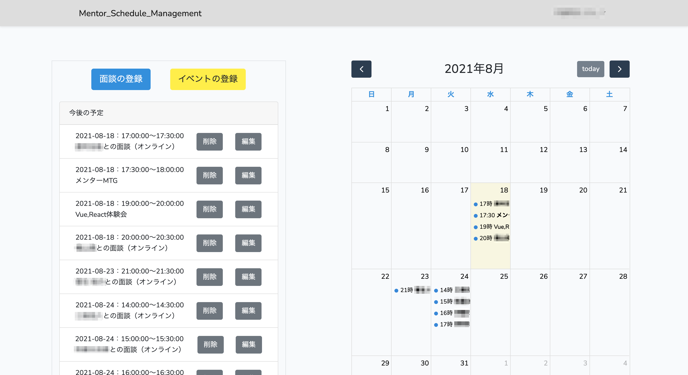
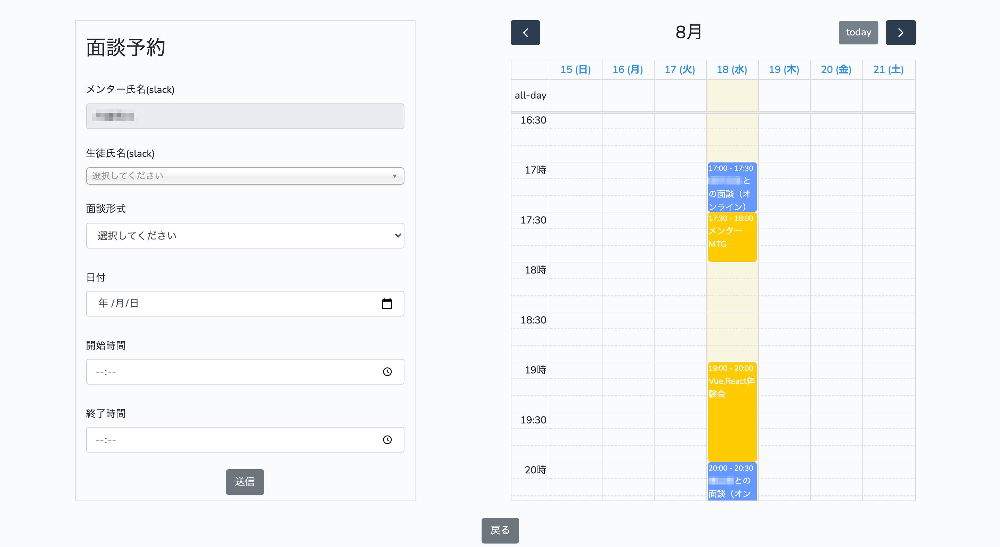
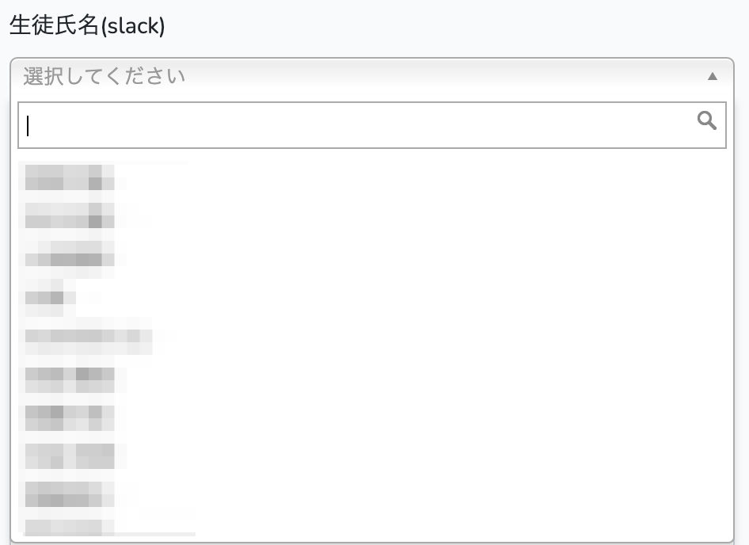

# Mentor_Schedule_Management
※ 本アプリは、インターン先で運用しているアプリのためテストを行うことが出来ません。ご了承ください。

本アプリは、「Slackへの自動リマインド機能を兼ね備えたカレンダーアプリ」です。\
ユーザーはイベントと面談をスケジュールとして登録することが出来、面談予定に関しては、登録された情報を基に、Slackへの自動送信を毎日AM11:00にメンション付きで行います。
（iPad以上のサイズ（画面幅>=768px）の端末での利用を考えているため、画面幅>=768pxの端末でのレスポンシブ対応のみされております。）

## 作成した背景/目的
私は、インターンの一環として、プログラミングスクールのメンターを務めております。
そちらでは、メンターが担当生徒と週に一回面談を実施し、各生徒の進捗把握を行なっております。
元々は、メンターが担当生徒との面談日時を決定する際に、メンター各自がGoogleカレンダーで自分の空いている時間を確認し、
Googleカレンダーに記入、面談当日になれば、そのGoogleカレンダーを確認し、Slackで面談のリマインドを行なっていました。
この問題点としては、「工程が多く、メンター側が手間であること」、「メンターが面談当日のリマインドを失念し、生徒が面談を忘れる可能性があること（実際、過去に起きました）」が挙げられます。
そこで、webページ上で予定を一括で管理出来、面談予定に関しては当日にSlackに自動リマインドが行われる「カレンダーアプリ」を作成しました。

## 開発環境
#### OS
macOS Big Sur バージョン11.4

#### フロントエンド
- HTML/CSS
- Bootstrap v4.0.0
- jQuery v3.2
- FullCalendar v5.7.2
- Chosen v1.8.7

#### バックエンド
- PHP v7.3.28
- Laravel v6.20.27

#### データベース
MariaDB v10.2

#### インフラ
AWS（EC2）

#### デプロイ
Heroku（ https://protected-meadow-92642.herokuapp.com/login ）

## 注力した機能
- ホーム画面では予定の日付・開始時間・終了時間で並び替えることで、直近の予定を分かりやすくしました

    

- 予定入力フォームとカレンダーを1ページの左右に表示させることで、既存の予定を確認しながら、新しい予定を入力できるようにしました（FullCalendarの利用）

    

- 生徒数が多いため、生徒氏名の入力フォームに検索機能をつけました（Chosenの利用）

    

- 面談予定についてはSlackへの自動送信機能を付けました（毎日AM11:00に自動送信）\
（Slack APIとHeroku Schedulerの利用）

    

## テーブル定義
#### usersテーブル
|  カラム名  |  データ型  |  詳細  |
| ---- | ---- | ---- |
|  id  |  bigint(20) unsigned  |  ID  |
|  name  |  varchar(255)  |  ユーザー名  |
|  password  |  varchar(255)  |  パスワード  |
|  rememberToken  |  varchar(100)  |  ログイン状態を保持  |
|  created_at  |  timestamp  |  データ作成時間  |
|  updated_at |  timestamp  |  データ更新時間  |

#### mentorsテーブル
|  カラム名  |  データ型  |  詳細  |
| ---- | ---- | ---- |
|  id  |  bigint(20) unsigned  |  ID  |
|  slack_id  |  varchar(50)  |  slackのID  |
|  slack_name  |  varchar(50)  |  slackでの表示名  |
|  created_at  |  timestamp  |  データ作成時間  |
|  updated_at |  timestamp  |  データ更新時間  |

#### studentsテーブル
|  カラム名  |  データ型  |  詳細  |
| ---- | ---- | ---- |
|  id  |  bigint(20) unsigned  |  ID  |
|  slack_id  |  varchar(50)  |  slackのID（メンション用カラム）  |
|  slack_name  |  varchar(50)  |  slackでの表示名  |
|  created_at  |  timestamp  |  データ作成時間  |
|  updated_at |  timestamp  |  データ更新時間  |

#### meetingsテーブル
|  カラム名  |  データ型  |  詳細  |
| ---- | ---- | ---- |
|  id  |  bigint(20) unsigned  |  ID  |
|  mentor_name  |  varchar(255)  |  メンター名  |
|  student_name  |  varchar(255)  |  生徒名  |
|  how_to  |  varchar(255)  |  面談方法  |
|  date  |  date  |  面談日付  |
|  beginning_time  |  time  |  面談開始時間  |
|  ending_time  |  time  |  面談終了時間  |
|  user_id  |  int(11)  |  usersテーブルとの連携用ID  |
|  created_at  |  timestamp  |  データ作成時間  |
|  updated_at |  timestamp  |  データ更新時間  |

#### eventsテーブル
|  カラム名  |  データ型  |  詳細  |
| ---- | ---- | ---- |
|  id  |  bigint(20) unsigned  |  ID  |
|  mentor_name  |  varchar(255)  |  メンター名  |
|  event_name  |  varchar(255)  |  イベント名（面談以外）  |
|  date  |  date  |  イベント日付  |
|  beginning_time  |  time  |  イベント開始時間  |
|  ending_time  |  time  |  イベント終了時間  |
|  user_id  |  int(11)  |  usersテーブルとの連携用ID  |
|  created_at  |  timestamp  |  データ作成時間  |
|  updated_at |  timestamp  |  データ更新時間  |
